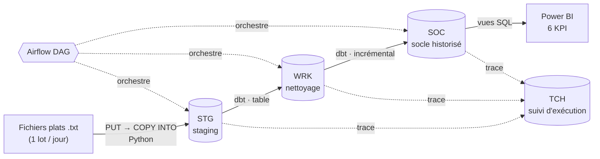
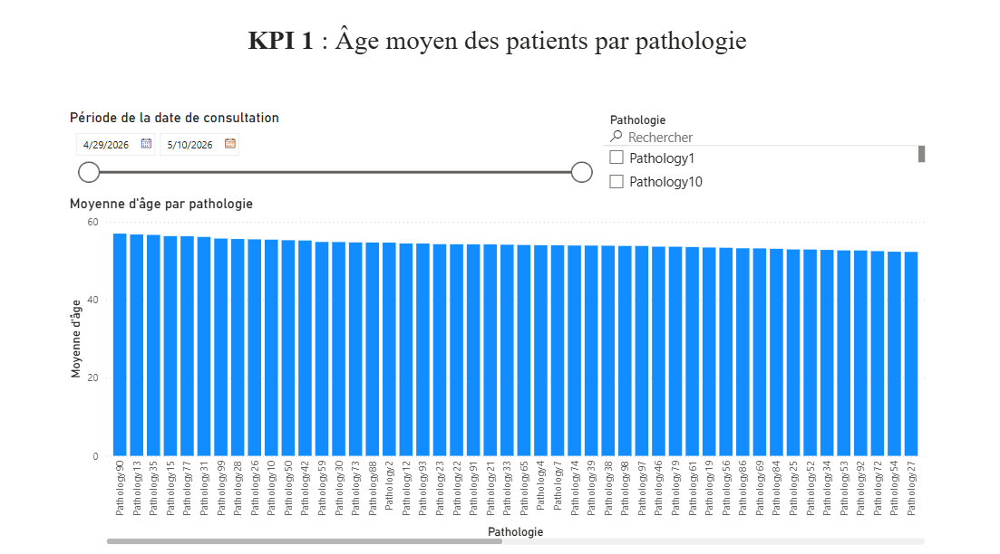
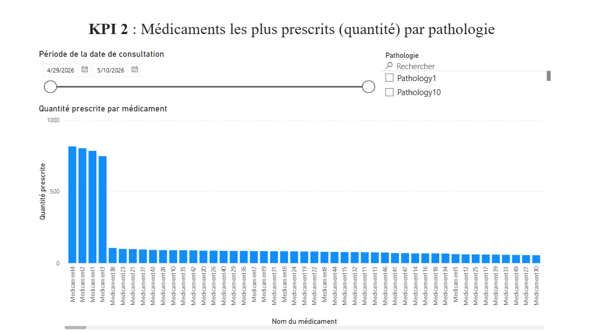
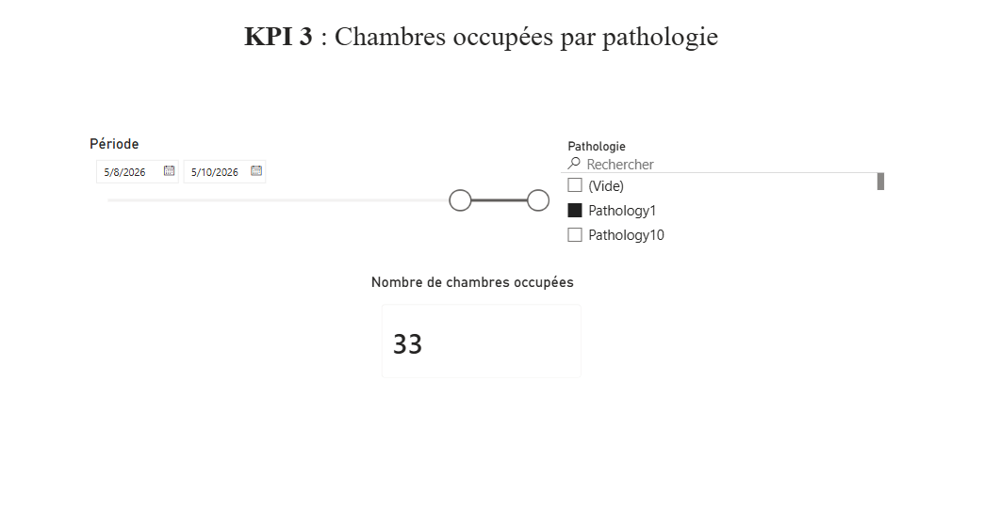
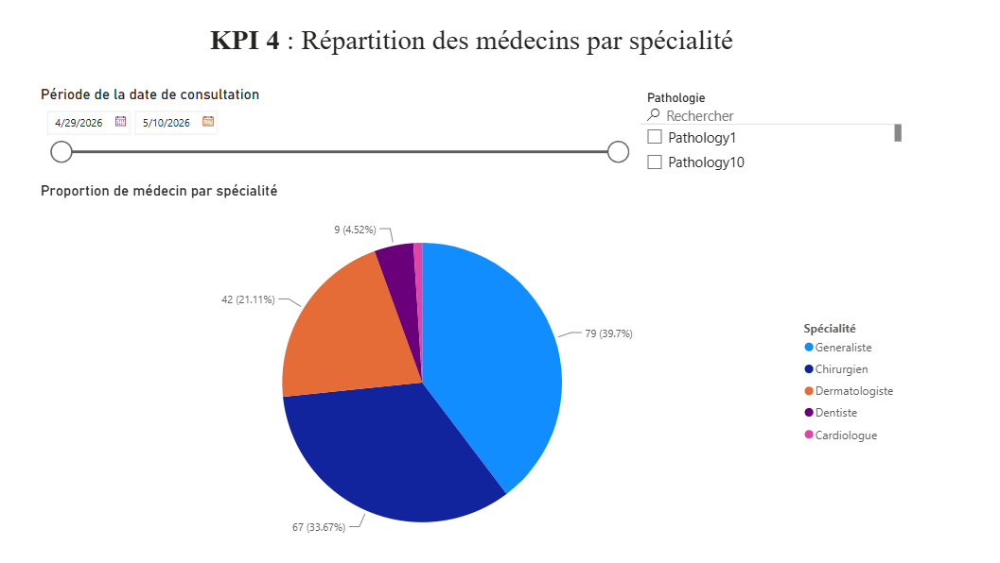
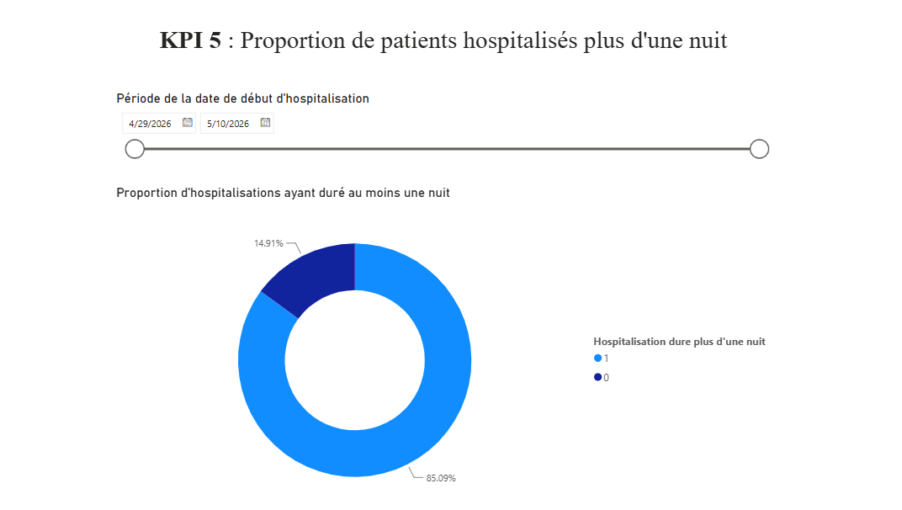
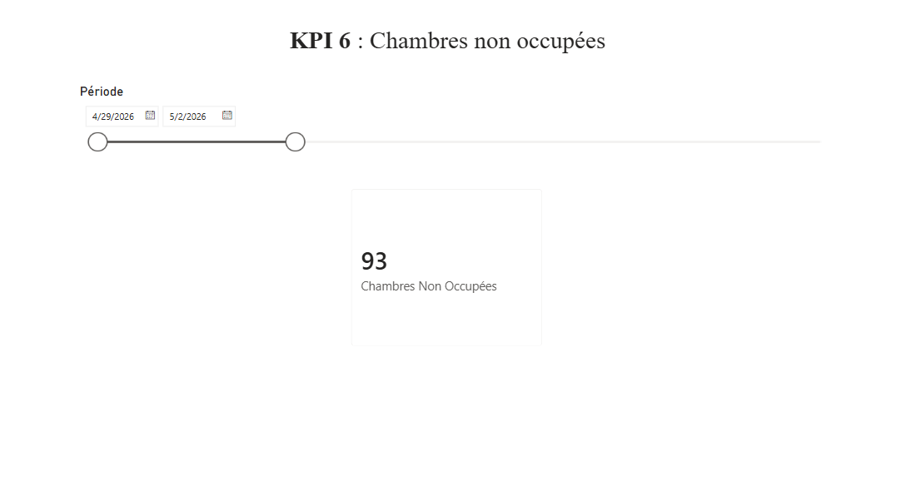

# Entrepôt de données hospitalier — Snowflake · dbt · Airflow · Power BI

Projet de fin de module **NF26 (UTC, 2026)** réalisé en partenariat avec **Smart Teem**, cabinet de conseil Data & IA.

L'objectif : construire de bout en bout le **système d'information décisionnel** d'un établissement de santé, depuis les fichiers plats quotidiens jusqu'aux tableaux de bord de pilotage.


---

## Ce que fait le projet

Chaque jour, l'hôpital produit un lot de fichiers texte : chambres, patients, personnel, consultations, hospitalisations, médicaments, traitements. Le pipeline :

1. **valide** que les fichiers du jour sont présents et complets ;
2. les **charge** dans Snowflake (zone de staging `STG`), en historisant la veille ;
3. les **transforme** avec dbt en deux couches : `WRK` (nettoyage) puis `SOC` (socle historisé, chargement incrémental) ;
4. **trace** chaque exécution dans un schéma technique `TCH` (début, fin, statut, script) ;
5. expose des **vues KPI** consommées par un tableau de bord Power BI.

L'ensemble est orchestré par **Apache Airflow**, avec reprise automatique des jours en échec.

## Architecture



| Couche | Rôle | Implémentation |
|---|---|---|
| **STG** | Copie brute du lot du jour, vidée et rechargée à chaque run | `src/load_data.py` (PUT → COPY INTO via un stage Snowflake) |
| **WRK** | Typage et nettoyage, recalculé à chaque run | 10 modèles dbt, matérialisés en `table` |
| **SOC** | Socle de données historisé : seules les nouvelles lignes sont ajoutées | 10 modèles dbt, matérialisés en `incremental` |
| **TCH** | Journal technique de chaque exécution (Python et dbt) | Tables `T_SUIV_RUN` / `T_SUIV_TRMT`, macros dbt `start_tracking` / `end_tracking` |

Les modèles physiques de données (MPD) des couches STG et SOC sont dans [`MPD/`](MPD/), au format DBML et PDF.

## Tableau de bord

Six indicateurs demandés par le client, calculés par des vues SQL sur la couche SOC ([`PowerBI/create_views/create_views.sql`](PowerBI/create_views/create_views.sql)), filtrables par période et par pathologie :

| | |
|---|---|
|  |  |
| **KPI 1** — Âge moyen des patients par pathologie | **KPI 2** — Médicaments les plus prescrits par pathologie |
|  |  |
| **KPI 3** — Chambres occupées par pathologie | **KPI 4** — Répartition des médecins par spécialité |
|  |  |
| **KPI 5** — Proportion d'hospitalisations de plus d'une nuit | **KPI 6** — Chambres non occupées sur une période |

## Points techniques notables

- **Idempotence** : l'installation (`SQL/install_sid.py`) peut être relancée sans risque (`CREATE … IF NOT EXISTS`).
- **Historisation de STG** : avant chaque rechargement, le contenu de STG est exporté dans `HISTORY/`, avec une durée de rétention configurable.
- **Reprise sur erreur** : un jour en échec est enregistré, puis retraité automatiquement au run suivant, sans bloquer les jours d'après.
- **Exécution séquentielle** : `max_active_runs=1`, chaque jour est entièrement traité (validation → STG → dbt) avant le suivant.
- **Traçabilité** : chaque modèle dbt écrit son début et sa fin dans TCH via des `pre_hook` / `post_hook`, avec l'`invocation_id` dbt comme identifiant d'exécution.
- **Double environnement** : les mêmes scripts tournent en local (identifiants dans `profiles.yml`) ou dans un Workspace Snowflake (jeton OAuth détecté automatiquement).

---

## Équipe et contributions

Projet réalisé à cinq : Etienne Vezien, Arthur Maugée, Mathieu Piekarz, Lewis Botokeky et Robin.

**Ma contribution (Mathieu Piekarz)** :

- **Ingestion des données** (`src/`) : chargement quotidien vers STG (PUT / COPY INTO), validation des fichiers sources, historisation et purge de STG, journalisation dans TCH, gestion et reprise des dates en échec ;
- **Installation du SID** (`SQL/`) : scripts de création des bases, schémas, tables et du stage Snowflake, et script d'installation automatisé ;
- **Orchestration** (`dags/`, `run_airflow.*`) : DAG Airflow du pipeline et de l'installation, scripts de lancement multiplateformes.

La modélisation dbt (`dbt_hopital/`) et le tableau de bord Power BI (`PowerBI/`) ont principalement été réalisés par mes coéquipiers.

---

## Lancer le projet

> **Données non incluses.** Les fichiers sources appartiennent au client et ne sont pas publiés. Pour exécuter le pipeline, placez vos dossiers `BDD_HOSPITAL_YYYYMMDD/` dans un répertoire de votre choix, puis indiquez-le via la variable `STG_DATA_DIR` ou l'option `--data-dir`.

### Prérequis

- [uv](https://docs.astral.sh/uv/) (gestionnaire d'environnement Python)
- Un compte Snowflake avec le rôle `ACCOUNTADMIN`

### 1. Environnement

```bash
uv sync
uv run dbt --version
```

### 2. Connexion Snowflake

```bash
cp dbt_hopital/profiles.yml.example dbt_hopital/profiles.yml
```

Renseignez `account`, `user` et `password` sous `outputs.local`. Ce fichier est ignoré par Git : ne le commitez jamais.

### 3. Installation des bases et des tables

```bash
uv run python SQL/install_sid.py
```

Vous pouvez aussi déclencher le DAG `dag_install_sid` depuis l'interface Airflow.

### 4. Exécution du pipeline

**Un jour, sans Airflow :**

```bash
uv run python src/load_data.py --date 20260429 --data-dir "/chemin/vers/Data Hospital"
uv run dbt run --project-dir dbt_hopital --profiles-dir dbt_hopital
```

Options de `load_data.py` :

| Option | Effet |
|---|---|
| `--date YYYYMMDD` | Jour à charger |
| `--data-dir CHEMIN` | Dossier contenant les `BDD_HOSPITAL_YYYYMMDD/` |
| `--retention-days N` | Nombre de jours d'historique STG conservés (défaut : 2) |
| `--skip-history` | Ne pas historiser STG avant de le vider |

**Avec Airflow** (une période complète) :

```bash
./run_airflow.sh        # Linux / macOS
.\run_airflow.ps1       # Windows (PowerShell)
```

Ouvrez ensuite **http://127.0.0.1:8080**. Lancez le DAG `dag_run_pipeline` avec **Trigger** et renseignez `date_debut`, et éventuellement `date_fin` : chaque jour de la période est traité dans l'ordre.

### Variables d'environnement

| Variable | Usage |
|---|---|
| `STG_DATA_DIR` | Dossier des fichiers sources |
| `STG_HISTORY_RETENTION_DAYS` | Durée de rétention de l'historique STG |
| `DBT_TARGET` | Forcer la cible dbt : `local` ou `workspace` |
| `AIRFLOW_HOME` | Racine du dépôt (défini automatiquement par `run_airflow.*`) |

Les journaux d'exécution sont écrits dans `logs/`.

## Arborescence

```
SQL/            Création des bases, schémas et tables Snowflake + script d'installation
src/            Pipeline Python : chargement STG, suivi TCH, reprise des dates en échec
dags/           DAG Airflow (pipeline et installation)
dbt_hopital/    Projet dbt : modèles WRK et SOC, macros de traçabilité
PowerBI/        Vues SQL des KPI et script d'export
MPD/            Modèles physiques de données (STG, SOC)
docs/           Captures du tableau de bord
```
